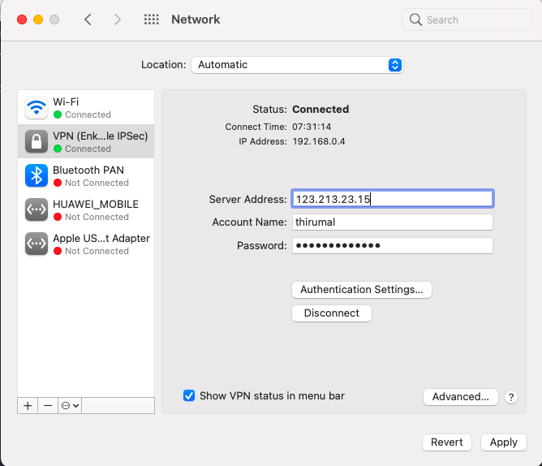

1. Go to `System Preferences` -> `Network`

2. Create new `Service` by clicking `+` in the left down corner.

3. Select the following,

	* `Interface`    => `VPN`
	* `VPN Type`     => `Cisco IPSec`
	* `Service Name` => `${Give Any Name}`

	
4. Enter the following details

	* Server Address
	* Account Name/User Name
	* Password

   

	* Click on `Authentication Settings` and add the following details,
		* `Shared secret`
		* `Group Name`
	* Finally, click 'Connect'

	

5. (OPTIONAL) Check the box to 'Show VPN status in the menu bar'.
