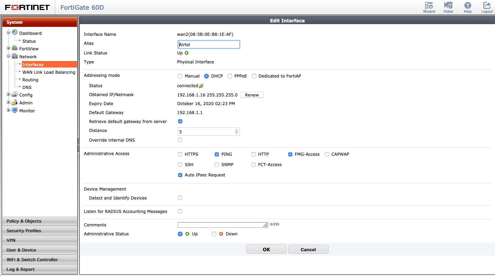

# Set up Dual/Load balancer internet in Fortigate

1. Set up WAN1
2. Plugin the second network (AIRTEL) to WAN2 port
3. Create new `Interface` under `system->network-Interfaces`
4. Configure similar to the image
    * Addressing mode - `DHCP`
    * Retrieve default gateway from server `Check the box`
    * Override internal DNS `UnCheck the box`
5. Create policy and configure
    * Incoming Interface - `internal`
    * Source Address  - `all`
    * Outgoing Interface - `wan2(airtel)`
    * Destination Address - `all`
    * Service - `ALL`
    * Action - `ACCEPT`
    * Firewall / Network Options - `NAT` => `ON`
        * Use Outgoing Interface Address - `Check the radio button`
6. Backup router distance should be less than default one.        
        
    

