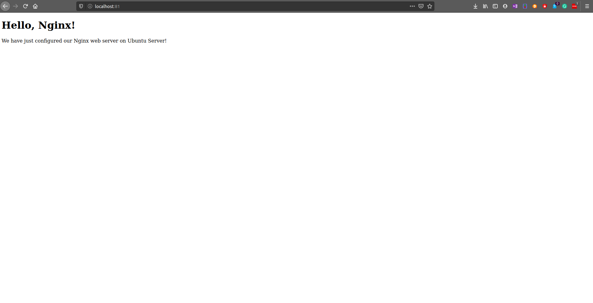

### Setting up virtual host

To set up virtual host, we need to create file in `/etc/nginx/sites-enabled/` directory.

For this tutorial, we will make our site available on 81 port, not the standard 80 port. You can change it if you would like to.

	sudo "${EDITOR:-vi}" tutorial

paste the below content to `tutorial` file
 
	server {
       listen 81;
       listen [::]:81;
       server_name example.ubuntu.com;
       root /var/www/tutorial;
       index index.html;
       location / {
               try_files $uri $uri/ =404;
       }
	}

`root` is a directory where we have placed our .html file. `index` is used to specify file available when visiting root directory of site. `server_name` can be anything you want, because you aren’t pointing it to any real domain by now.

### Activating virtual host and testing results

	sudo service nginx restart
	

