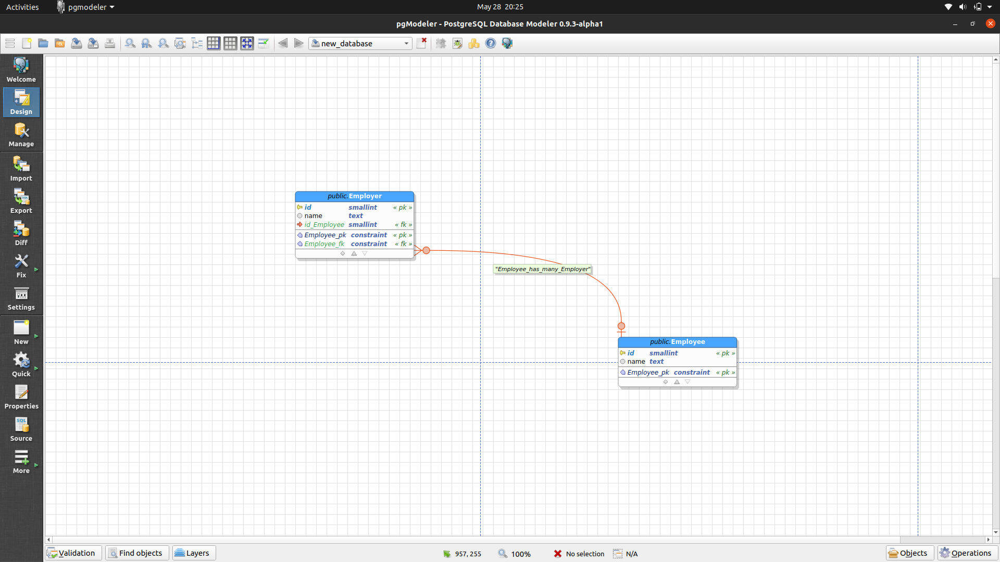
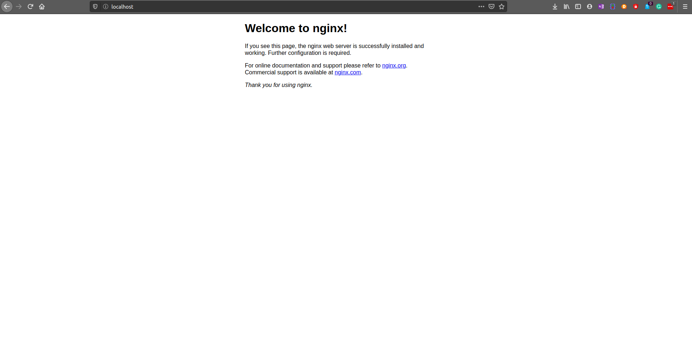
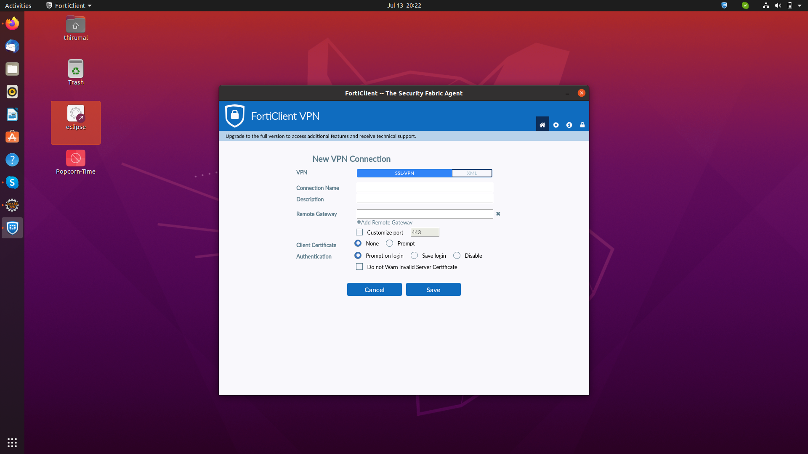

# Installation Guide

### Build PgModeler from source code
1. [Guide for Ubuntu](pgmodeler/build_pgmodeler_from_source_ubuntu.md)
2. [Guide for Mac](pgmodeler/build_pgmodeler_from_source_mac.md)

### Install PostgreSQL
1. [Install and Configure PostgreSQL](PostgreSQL/Install_PostgresQL_in_Ubuntu.md)

### Install PgAdmin4
1. [PgAdmin using Apache2](pgadmin4/install_pgadmin4_using_apache2.md)
2. [PgAdmin4 using Docker](pgadmin4/install_pgadmin4_using_docker.md)
3. [Update PgAdmin4 docker image](pgadmin4/update_pgadmin4_docker_image.md)

### FortiClient VPN
1. [Install Forticlient VPN on Ubuntu 20.04](Forticlient/Install_FortiClient_Ubuntu.md)

### Install Redis from source
1. [Guide for Ubuntu](redis/install_redis_in_ubuntu_from_source.md)
2. [Guide for Mac OS](redis/install_redis_in_mac_from_source.md)
3. [Enable remote access](redis/redis_enable_remote_access.md)

### AWS - Website hosting
1. [Host static website using S3](aws/host_static_website_using_s3.md)

### Nginx
1. [Install & Virtual host Niginx](Nginx/installation_in_Ubuntu.md)
2. [Reverse Proxy using symblink](Nginx/reverse_proxy_with_symblink.md)

### Git
1. [SSH Clone](git/ssh_git_clone.md)

### PgModeler Output

### PgAdmin4 Output

### Nginx output

### Forticlient 

