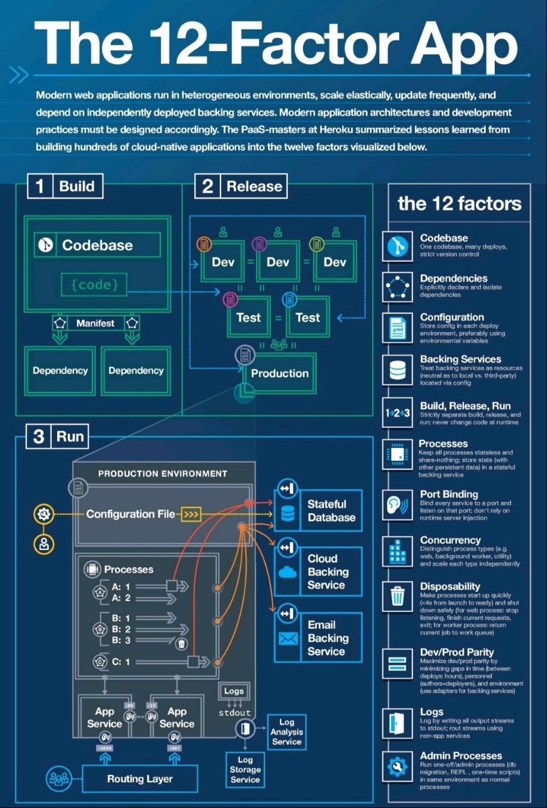

# Installation Guide

Visit [https://m-thirumal.github.io/installation_guide/](https://m-thirumal.github.io/installation_guide/) for HTML view

### Build PgModeler from source code:
  * [Guide for Ubuntu](pgmodeler/build_pgmodeler_from_source_ubuntu.md)
  * [Guide for Mac](pgmodeler/build_pgmodeler_from_source_mac.md)
  * [FWD - Foreign Data Wrapper](/pgmodeler/foreign_data_wrapper.md)
  * [Extension](/pgmodeler/Extension.md)
  * [Exclusion Constraints](/pgmodeler/Exclusion%20Constraints.md)
  * [Role/User](/pgmodeler/Role.md)

### Install PostgreSQL

* [Install PostgreSQL](PostgreSQL/Install_PostgresQL_in_Ubuntu.md)

* [UnInstall](PostgreSQL/UnInstall%20PostgreSQL.md)

* [WAL Archive & PITR](PostgreSQL/WAL%20Archive%20&%20PITR.md)

### Cassandra

1. [Cassandra Installation](Cassandra/Installation.md)

* [JanusGraph](JanusGraph/JanusGraph.md)

  * [Install and configuration of database](JanusGraph/Installation.md)
  * [Cassandra Storage backend](JanusGraph/Cassandra%20Storage%20Backend.md)
  * [Configuration](JanusGraph/Configuration.md)
  * [Run Janus on different Port](JanusGraph/Run%20Janus%20on%20different%20Port.md)
  * [Change Cassandra keystore](JanusGraph/Change%20Keystore.md)
  * [Gremlin Console](JanusGraph/Gremlin%20Console.md)
  * [Management API](JanusGraph/Management%20API.md)
  * [Indexing](JanusGraph/indexing.md)
  * [Schema & Index](JanusGraph/Schema%20Index.md)
  * [Drop Graph database](JanusGraph/Drop%20Database.md)
  * [Visualization Tool](JanusGraph/Visualization%20Tool.md)
  * [Frequently Used Queries](JanusGraph/Frequently%20Used%20Query.md)
  * [Hosting Multiple Graph](JanusGraph/Hosting%20Multiple%20Graph.md)
  * [Troubleshoot](JanusGraph/Trobleshoot.md)

### Install PgAdmin4
1. [PgAdmin using Apache2](pgadmin4/install_pgadmin4_using_apache2.md)
2. [PgAdmin4 using Docker](pgadmin4/install_pgadmin4_using_docker.md)
3. [Update PgAdmin4 docker image](pgadmin4/update_pgadmin4_docker_image.md)

### Open Project

1. [Installation and configuration](openProject/installation.md)

### VMware ESXi

1. [Start VM's automatically during the boot](VMware%20ESXi/Start%20VM's%20automatically%20during%20the%20boot.md)

### Docker
1. [Installation](docker/installtion_configuration.md)
2. [Commands](docker/commands.md)
3. [Build Image](docker/build_image.md)
4. [Context](docker/context.md)
5. [Persistent Data & Volume](docker/persistent_data&volume.md)
6. [Docker UI](docker/docker_ui_Portainer.md)
7. [Network](docker/network.md)
8. [Docker Spring Boot](docker/spring-boot.md)

### FortiClient VPN
1. [Install Forticlient VPN on Ubuntu 20.04](Forticlient/Install_FortiClient_Ubuntu.md)
2. [IPsec VPN in Ubuntu](Forticlient/IPsec%20VPN%20in%20Ubuntu.md)

### Fortigate
1. [IPsec Setup for Linux/Ubuntu](Fortigate/IPsec%20for%20Ubuntu.md)
2. [Network Load balancing](Fortigate/Load%20balancer/Dual%20Intenet%20connection.md)

### Java
1.[Installation](Java/Installation.md)

### Python
1.[Installation](python/installation.md)
2.[Installation](python/virtualevn.adoc)

### [Jenkins](jenkin/jenkins.md)
  * [Install Jenkin](jenkin/installation.md)
  * [Config with Private IP](jenkin/config_with_private_ip.md)
  * [Email Integration/notification](jenkin/Email%20Integration.md)
  * [Install jenkin on docker](jenkin/jenkin_on_docker.md)
  * [Backup & Restore](jenkin/backup_restore.md)
  * [Troubleshoot](jenkin/Troubleshoot.md)

### Redis

* [Install](redis/install.md)

  * [Install from Source on ubuntu - Shell file](redis/install_redis_from_source_ubuntu.sh)
  * [Install from source on Mac](redis/install_redis_in_mac_from_source.md)
  * Docker
         `docker pull redis`
    
* [Redis Clients](redis/redis-client.md)

* [Enable Remote Access](redis/redis_enable_remote_access.md)

* [Troubleshoot](redis/troubleshoot.md)

* [Uninstall](redis/Uninstall.md)

* [Redis Server shell file](redis/redis-server)

### AWS - Website hosting
1. [Host static website using S3](aws/host_static_website_using_s3.md)
2. [Add TLS for AWS S3 hosted static website using Let's Encrypt](aws/tls/create_cloud_front.md)
3. [S3](aws/S3)
   1. [Commands](aws/S3/commands.md)
   2. [Set up Local Programmatic user in Ubuntu/Mac Os](aws/S3/Set-up%20user%20in%20Ubuntu/Mac.md)
   3. [Cross Account S3 bucket object Copy](aws/S3/Set-up%20user%20in%20Ubuntu/cross_account_S3_copy.md)

### TLS
1. [Generate Free TLS/SSL using Let's Encrypt](TLS/let's_encrypt.md)

### Nginx
1. [Install & Virtual host Niginx](Nginx/installation_in_Ubuntu.md)
2. [Reverse Proxy using symblink](Nginx/reverse_proxy_with_symblink.md)
3. [Add TLS For Nginx Hosted Site](Nginx/Add_TLS_For_Nginx_Hosted_Site.md)
4. [Redirect IP address access to domain name](Nginx/Redirect%20IP%20address%20to%20domain%20name.md)

### [Git](git/git.md)
  * [Basic Commands](git/commands.md)
  * [SSH Clone](git/ssh_git_clone.md)
  * [Repository migration](git/git_repo_migration.md)
  * [Export as Zip](git/Export.md)
  * [TroubleShoot](git/Troubleshoot.md)

### 12 Factor App

### PgModeler Output

### PgAdmin4 Output

### Nginx output

### Spring boot

1. [Create JAR](spring-boot-jar/create_jar.md)

### Forticlient

### Maven
1. [Upgrade Maven](maven/upgrade_maven.md)

### [Wordpress](wordpress/wordpress.md)

* [Installation](wordpress/wordpress.md)
* [Export/Import](/wordpress/export_import.md)
* [Troubleshoot](/wordpress/troubleshoot.md)

<!-- GitAds-Verify: I46KOYYVLA5JXD5319KJK8ELUJ8ZXZXF -->