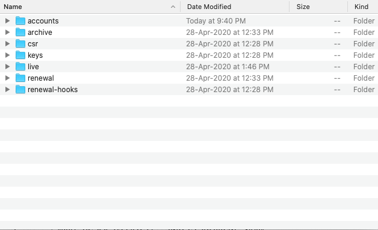
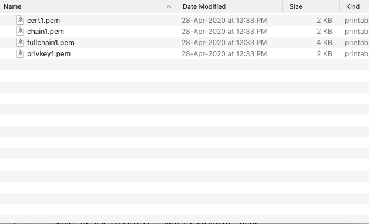

# Generate Free TLS/SSL using Let's Encrypt

1. Start Docker and pull `certbot` image

	`docker pull certbot/certbot`
	

2. Run the below command

	`docker run -it -v /Users/thirumal/certificate:/etc/letsencrypt certbot/certbot certonly --manual --preferred-challenges dns --email xxxx@YYYY.com --server https://acme-v02.api.letsencrypt.org/directory --agree-tos -d '*.example.com'`
	
3. After running the above command it will ask you to add TXT record to your DNS before pressing enter.

4. Login to your Domain provider (Godaddy/AWS Route 53) to add DNS TXT records.
	
	`Record name : _acme-challenge.example.com.`
	
	`Recort type : txt`
	
	`Value       : {displayed in the terminal}`

5. Return to your Terminal and press enter to validate and to generate the TLS

6. It will generate few folders which similar to the image 

7. `PEM` files can be found in `archive\domain name\`

### Add the certificates in the AWS certificate manager

1. Create certificate manager in `N-Virginia` region
2. Go to AWS Certificate Manager > Import a certificate
3. Add the content of `cert.pem` to Certificate body
4. Add the content of `privkey.pem` to Certificate private key
5. Add the content of `chain.pem` to Certificate chain

