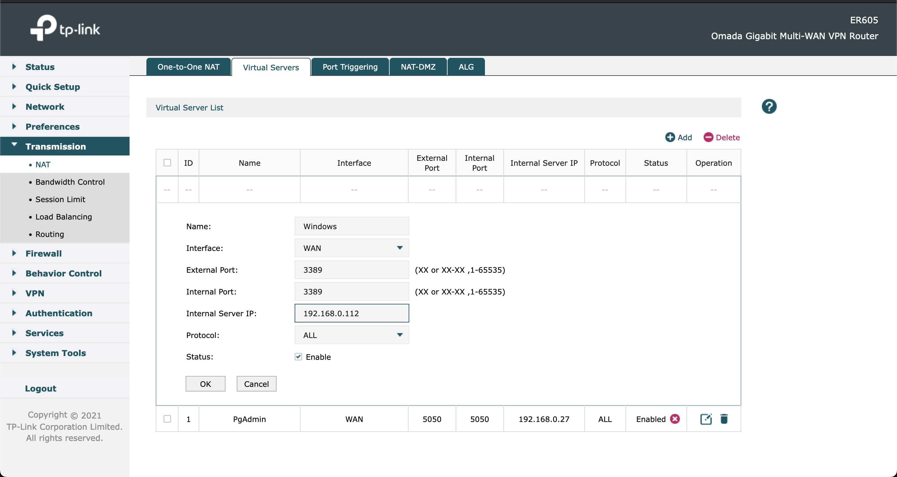

# PORT FORWARDING

Port forwarding is used to send the internet traffic to the internal LAN server/VM applications. We need to map the extenal port with internal application IP & port

Steps:

1. Login to tp-link router

2. Go to `Transmission` -> `NAT` -> `Virtual Server`

3. Add new `Virtual Server` by following the screenshot

