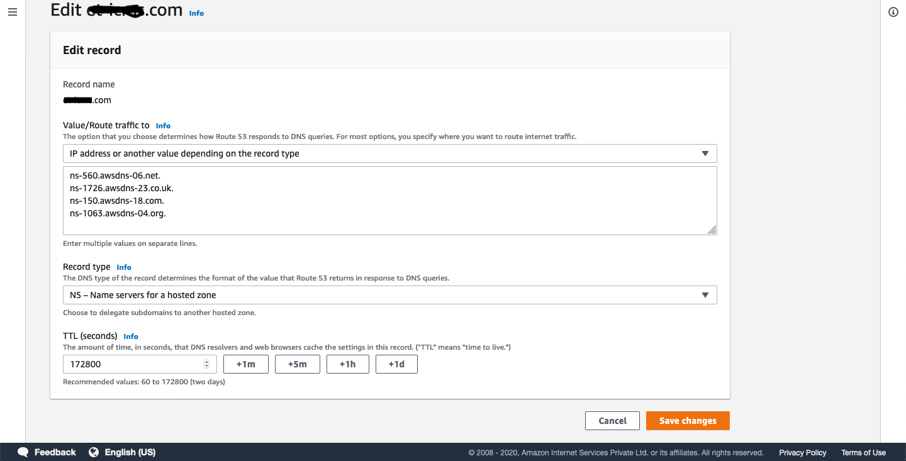
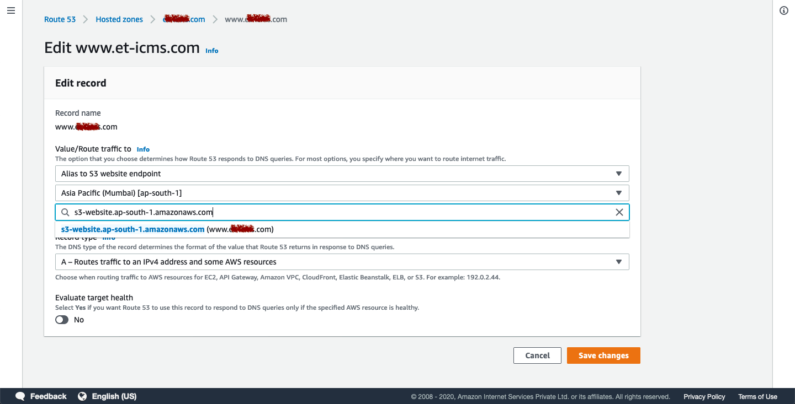

# Host static website using S3

1. Create two S3 bucket with your domain name `(www and non-www)`
	
	1. example.com	
	2. www.example.com

2. Configure `non-www` bucket to redirect to `www` bucket

  

3. Upload your web content to www bucket

4. Configure www bucket for web-hosting by selecting `static website hosting`

 

5. Make www bucket as `public` and add the below `policy`

```
{
    "Version": "2012-10-17",
    "Statement": [
        {
            "Sid": "PublicReadGetObject",
            "Effect":"Allow",
            "Principal": "*",
            "Action": "s3:GetObject",
            "Resource": "arn:aws:s3:::www.example.com/*"
        }
    ]
}
```
  
  
  

6. Create AWS route53 public hosted zone with the same name as the domain name (Non-WWW).

7. Update GoDaddy NS with AWS provided NS (without ending dot(.).

  

8. In AWS Route53 
	
	create `A Type`  recordset for the `non-www` domain and select 
	
	1. Alias to S3 website endpoint, 
	2. Select the region of your bucket
	3. Select your `S3 main bucket` (i.e non-www domain)
	
	create `A Type` recordset for `www` subdomain and repeat the above steps/points except the selecting S3 `www` bucket.
	
  
	
9. Access your web site from browser. Enjoy

