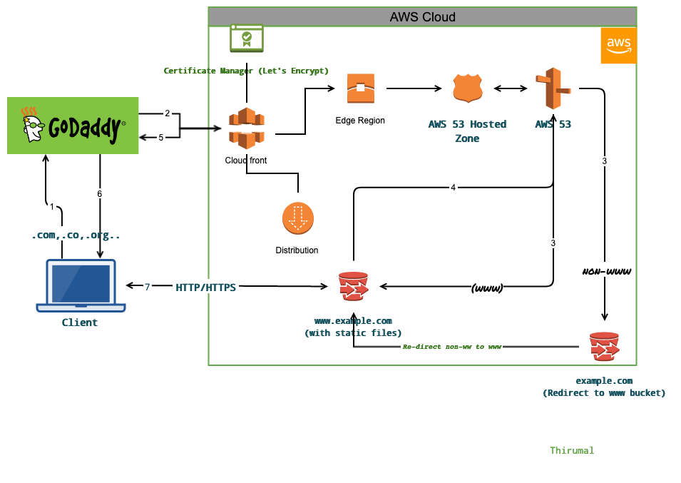
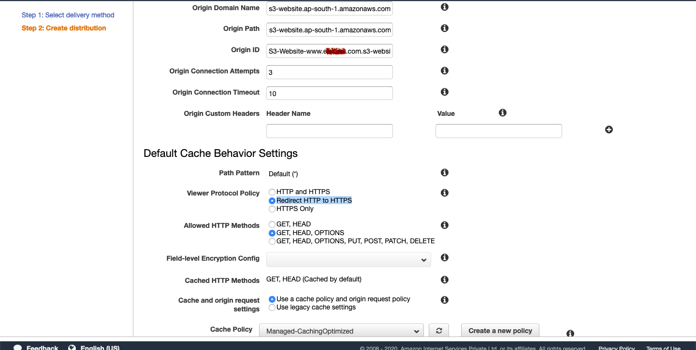
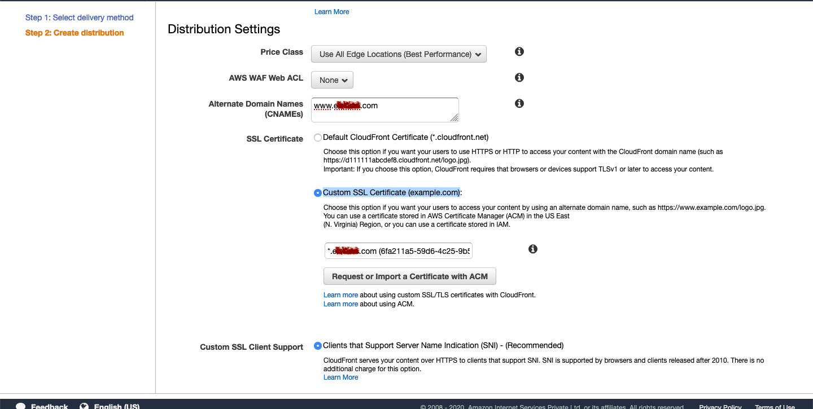
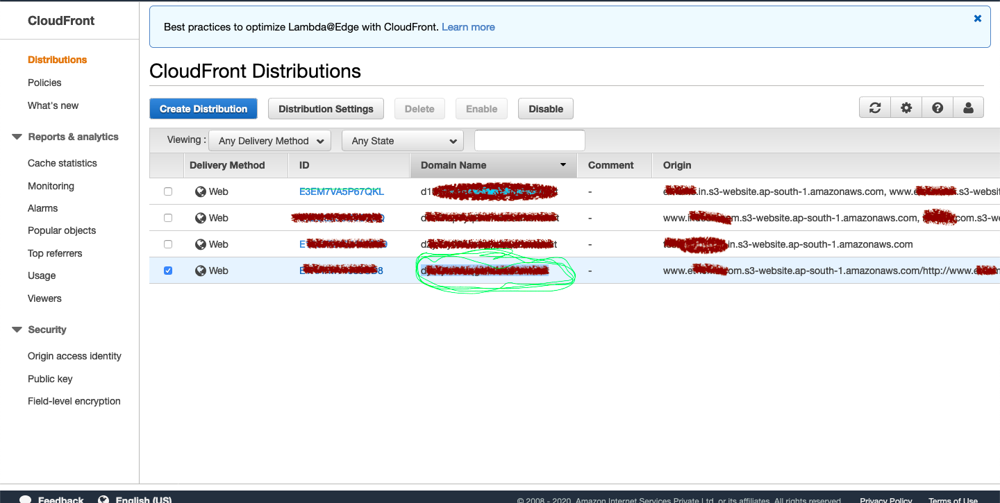
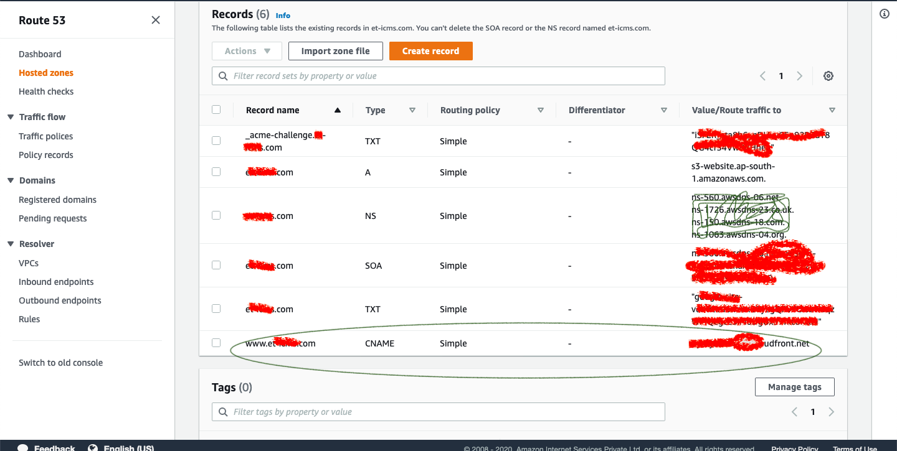

# Set up Cloud Front for S3 static web site

###Steps

1. Generate TLS & add the certificate to `Certificate Manager`. Refer [Let's Encrypt doc](../../TLS/let's_encrypt.md)

2. Go to Cloud Front and select `Create distribution` and again select `Get Started` under `Web`.

3. Copy the end point from `www domain name` S3 bucket (Caution: Don't select the auto-select option) and add to `Origin Domain name`

  
  
4. In `Default Cache Behavior Settings` -> `Viewer Protocol policy`  select `Redirect HTTP to HTTPS`

5. In `Distribution Settings` add `Alternate Domain Names (CNAMEs)` 
   
    `www.example.com`
6. In `SSL Certificate` select `Custom SSL Certificate (example.com)` and select the `imported certificate` from the `Certificate Manager`

  
  

7. Leave everything with default configuration & create

#### Point Domain to CloudFront

8. Copy the `Domain Name` that is displayed in the row after create

  

9. Add that as `CNAME` in `Route53`

  
  
  

Expected error `Key is not found` will be in the origin path (Clear)
