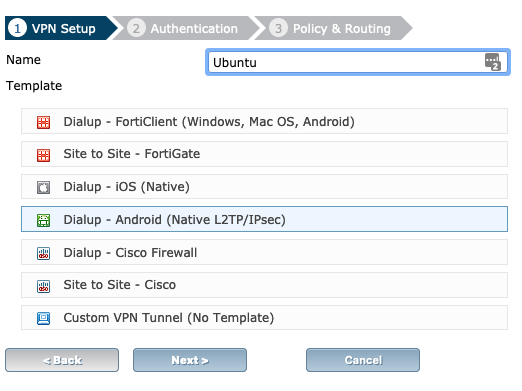
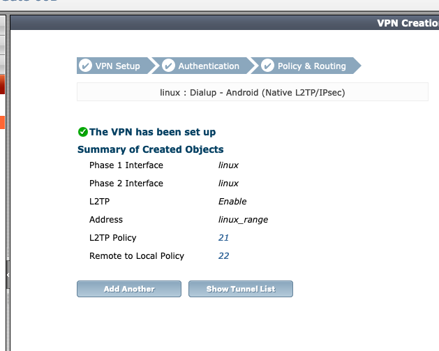

# Set up IPsec VPN for Linux Systems

* Go to `VPN` -> `IPsec` -> `Tunnels`
* Create new `Tunnels`
  * Select `Dialup - Android (Native L2TP/IPsec)`
  * Authentication
    * `WAN1` - Incomming Interfaces
    * `Pre-shared key` - Authentication method (Enter the password)
    * `VPN Group` - Select the VPN Group
  * Policy & Routing
    * `Internal` - Local Interface
    * `all` - Local Address
    * `192.168.0.2-192.168.0.253` - client Address
    * `255.255.255.255` - Subnet mask

