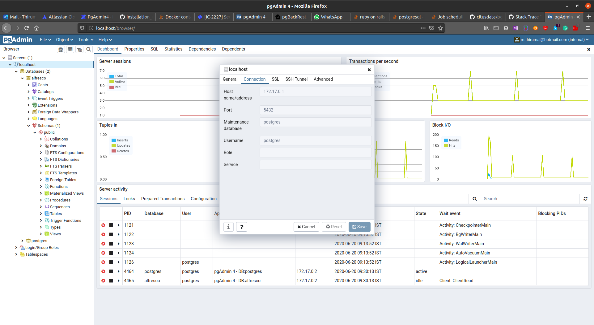
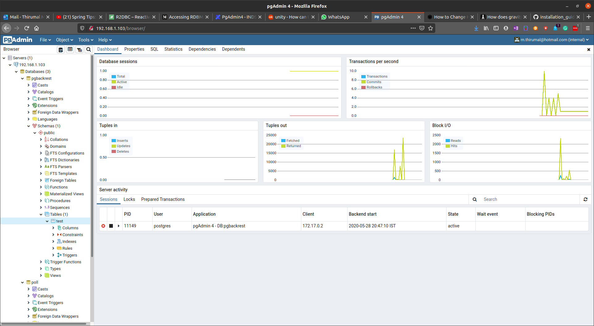

# Install & Configure PgAdmin 4 using docker 

1. [Install PostgreSQL](../PostgreSQL/Install_PostgresQL_in_Ubuntu.md)

2. Set up docker
	```
	sudo apt install docker.io
	```

3. Pull pgadmin4 image
	```
	sudo docker pull dpage/pgadmin4
	```
4. Create a directory in the host to store session data of PgAdmin4
	```
	sudo mkdir /var/lib/pgadmin
	```
5. Map to Pgadmin user & group 5050
	```
	sudo chown -R 5050:5050 /var/lib/pgadmin/
	```
6. Finally run the docker image
	```
	sudo docker run --name pgadmin -p 80:80 -v /var/lib/pgadmin:/var/lib/pgadmin  -e 'PGADMIN_DEFAULT_EMAIL=m.thirumal@hotmail.com' -e 'PGADMIN_DEFAULT_PASSWORD=thirumal' -d dpage/pgadmin4
	```
	
  or [For Reverse Proxy](Reverse_Proxying_with_ngnix.md) 
	
	sudo docker run --name pgadmin -p 5050:80 -v /var/lib/pgadmin:/var/lib/pgadmin  -e 'PGADMIN_DEFAULT_EMAIL=m.thirumal@hotmail.com' -e 'PGADMIN_DEFAULT_PASSWORD=thirumal' -d dpage/pgadmin4
	

7. Enter your IP address in the browser to access pgadmin4

8. Create server with host name/address `172.17.0.1`
    
    
    
9. To start docker container

	`sudo docker start pgadmin`


   

10. [Set up Reverse Proxy with Ngnix](Reverse_Proxying_with_ngnix.md)
