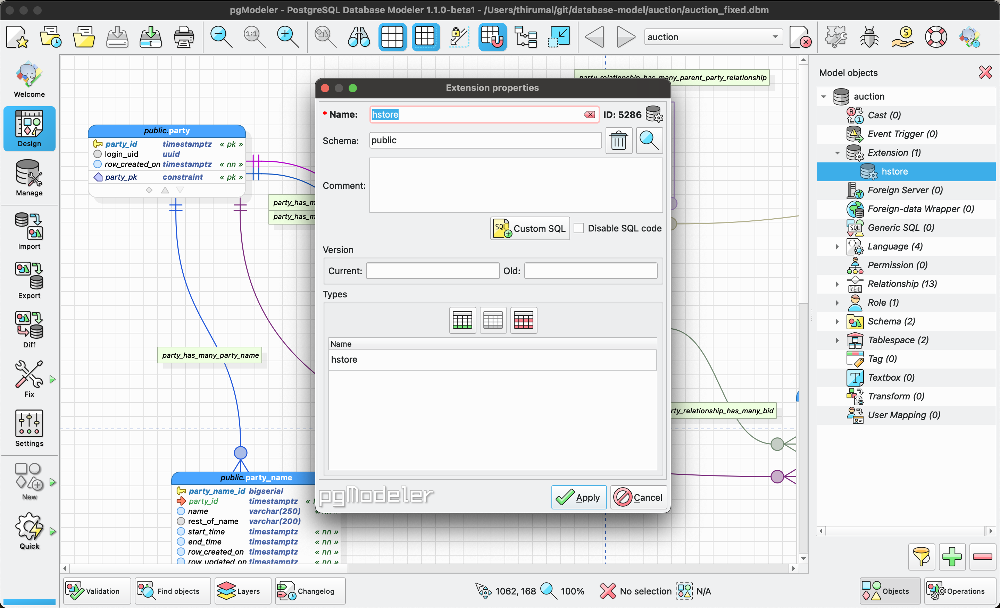

# How to add extension in pgModeler

* Go to `objects` on the right bottom corner

* Find `Extension` and create new extension by giving the name of extension (eg: hstore) and column that requires (eg: hstore)

