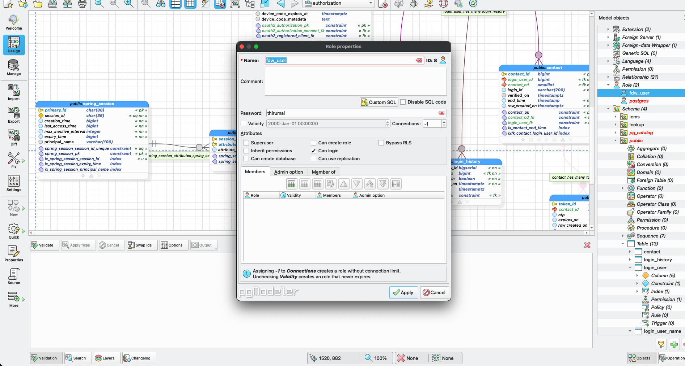
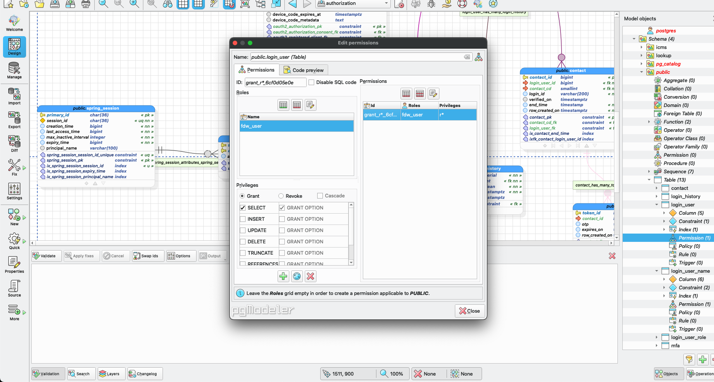

# Create Role/User

* Go to `Objects` and right click on the `Role`

* Give the `name` of the role and enter the `password`

* Add member or Expand `schema` -> `Permission` -> Select `role` -> Give `Privilages`

* Go to the `table/schema` -> `permission` to provide the privilege.

