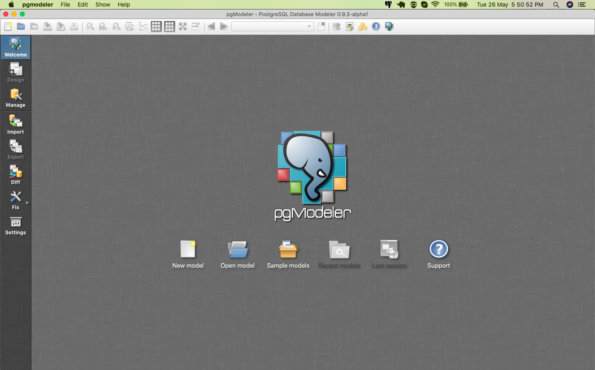
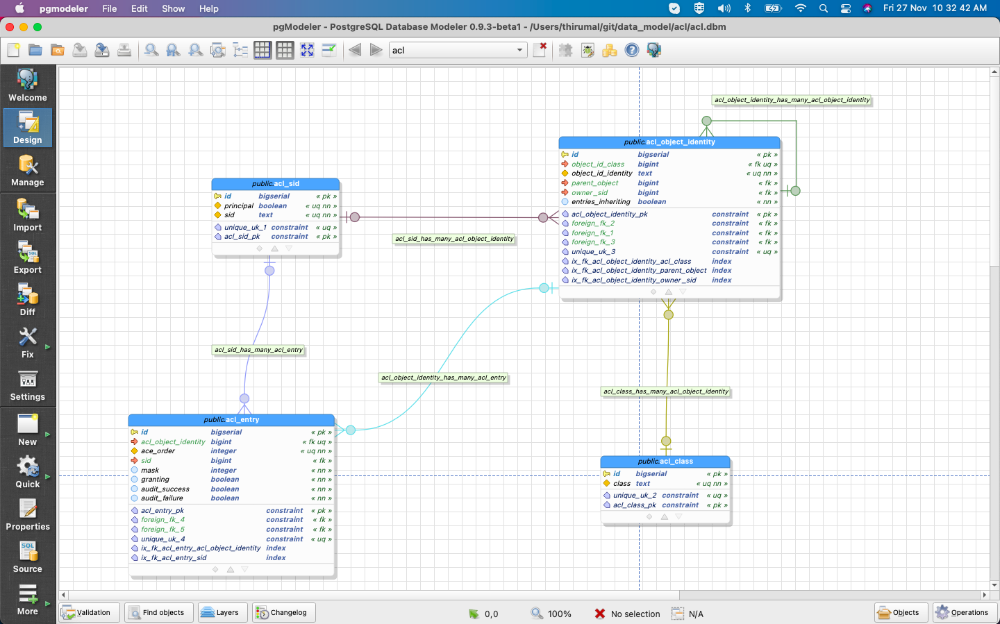

### Build pgmodeler from the source for MAC

### Clone

```bash
git clone https://github.com/pgmodeler/pgmodeler.git
cd pgmodeler
```

### Prerequisites

1. Install `PostgreSQL`
2. Install `Xcode`
3. Install `libxml2`, `qt` & `libpq`

```bash
brew install qt libxml2 libpq
```

And change the installation path in `pgmodeler.pri`, something similar to the following configuration

```c++
macx {
  PGSQL_LIB = /Applications/Postgres.app/Contents/Versions/latest/lib/libpq.dylib
  PGSQL_INC = /Applications/Postgres.app/Contents/Versions/latest/include
  XML_INC = /usr/local/Cellar/libxml2/2.11.4_1/include/libxml2
  XML_LIB = /usr/local/Cellar/libxml2/2.11.4_1/lib/libxml2.dylib
  INCLUDEPATH += $$PGSQL_INC $$XML_INC
}
```

then, run the below command to build

```bash
/usr/local/opt/qt/bin/qmake -r pgmodeler.pro
```

### For M1, M2... Chip

```c++
macx {
  !defined(PGSQL_LIB, var): PGSQL_LIB = /Applications/Postgres.app/Contents/Versions/latest/lib/libpq.dylib
  !defined(PGSQL_INC, var): PGSQL_INC = /Applications/Postgres.app/Contents/Versions/latest/include
  !defined(XML_INC, var): XML_INC = /opt/homebrew/opt/libxml2/include/libxml2
  !defined(XML_LIB, var): XML_LIB = /opt/homebrew/opt/libxml2/lib/libxml2.dylib
  INCLUDEPATH += "$$PGSQL_INC" "$$XML_INC"
}
```

then, run the below command to build

```bash
/opt/homebrew/opt/qt6/bin/qmake -r pgmodeler.pro
```

### Install

Run the below command to install pgModeler in `/Application`

```bash
sudo make && make install
```

Go to application and select pgmodeler

Enjoy !!!





#### Known Problem

* Dark shaded table and relationships

   Go to -> PgModeler -> Preferences -> Appearance -> Select `Default`
