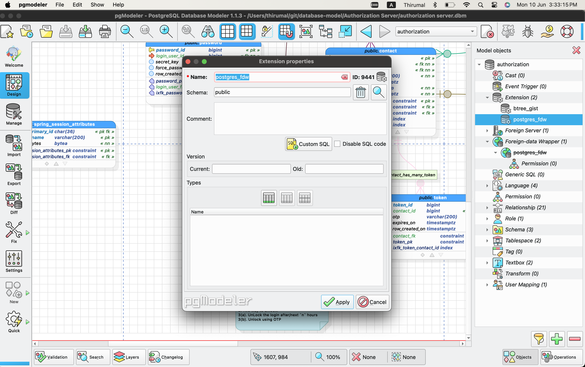
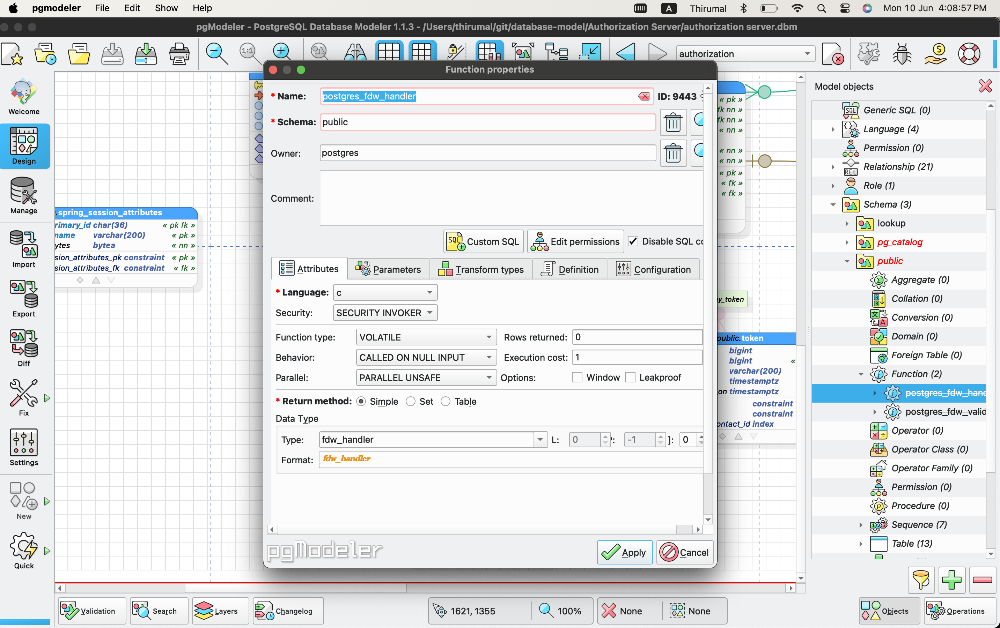
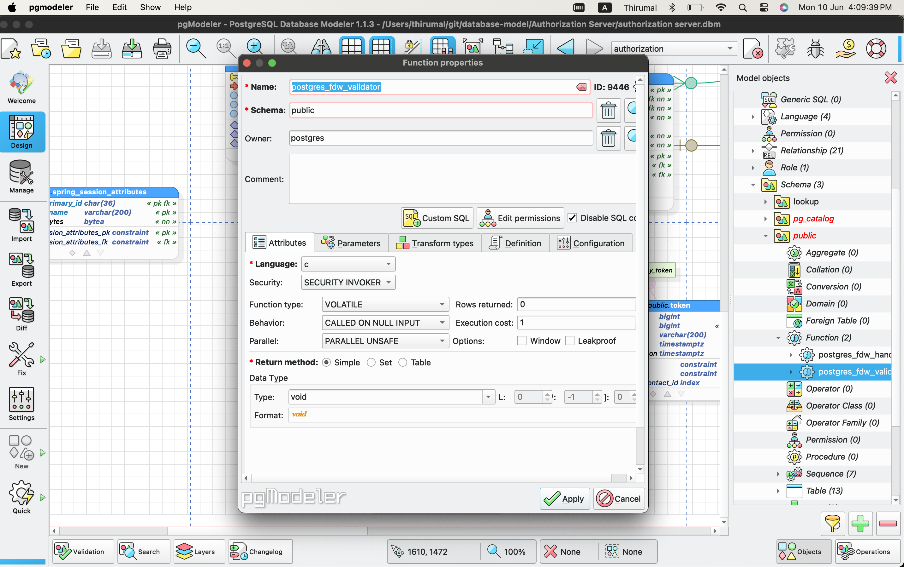
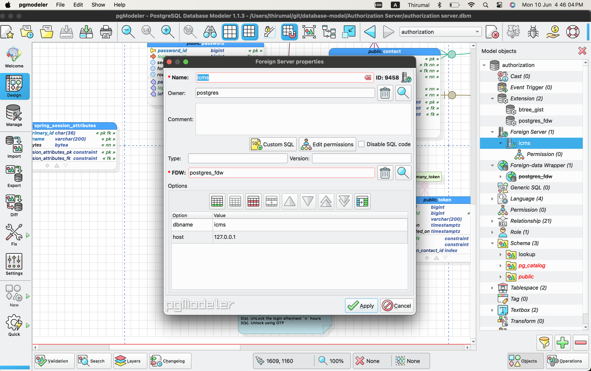
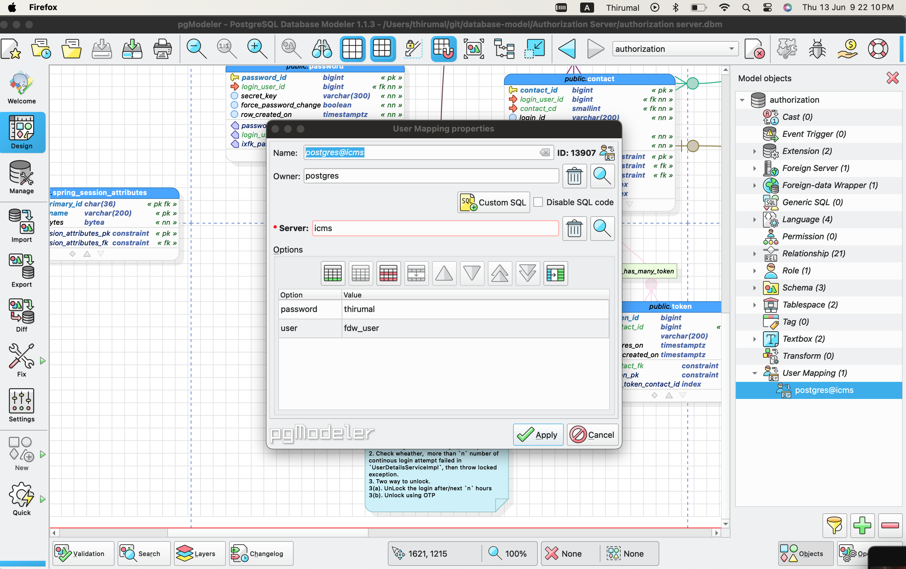
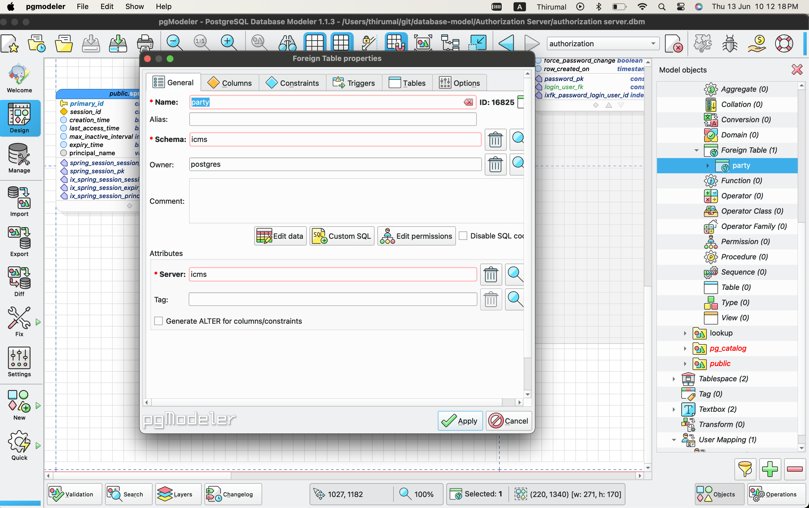

# FDW - Foreign Data Wrapper

A foreign data wrapper is an extension available in PostgreSQL that allows you to consume data from different data sources not necessarily another PostgreSQL database system. Foreign data wrappers can serve all sorts of purposes:

* Completing a data flow cycle
* Your data may be segregated across databases, but still related in ways that makes being able to combine or aggregate it desirable
* Allows you to control the permissions on the foreign tables

## Set up in Local Server

1. Add `postgres_fdw` extension



2. Create two function
    1. Handler with name `postgres_fdw_handler` with 
      * Attribute
        * Language - `c`
        * Return method - `simple`
        * Data type - `fwd_handler`
      * Definition
        * Symbol - `$libdir/postgres_fdw`
        * Library - `postgres_fdw_handler`
      * Disable `SQL` code
    2. Validator with name `postgres_fdw_validator` with data type `void`





3. Create FDW (Foreign  Data Wrapper), with the above created `handler` and `validator`.


4. Create `Foreign Server` with the following options
    1. dbname - `postgres`
    2. host   - `127.0.0.1`
    3. port   - `5432`

!> Please ensure that the `remote database cluster` has the `pg_hba.conf` entry corresponding to the database server for which the foreign server has to be created.

Debug with following SQL

```sql
select * from pg_foreign_server;
```



5. Create `USER MAPPING`

  Select `server` and enter the user name and password in the options

  ```sql
user     : fdw_user
password : thirumal
  ```

Debug with following query

```sql
select * from pg_user_mapping
```



6. Import or Create `foreign table`

 To import use the following SQL

 ```sql
IMPORT FOREIGN SCHEMA foreign_schema FROM SERVER foreign_server INTO public;
 ```

 Create `schema` with same name, if it's not available and create `foreign table`

 

## Set in Remote server

1. Create `read_only` user (Eg:`fwd_user`) in the `remote server` with enough `privilage` on the `schema/tables`.

2. [Role](/pgmodeler/Role.md)

3. Give permission for foriegn server to access in `pg_hba.conf`

```bash
# IPv4 local connections:
host    db_name     fwd_user             127.0.0.1/32            scram-sha-256
```
