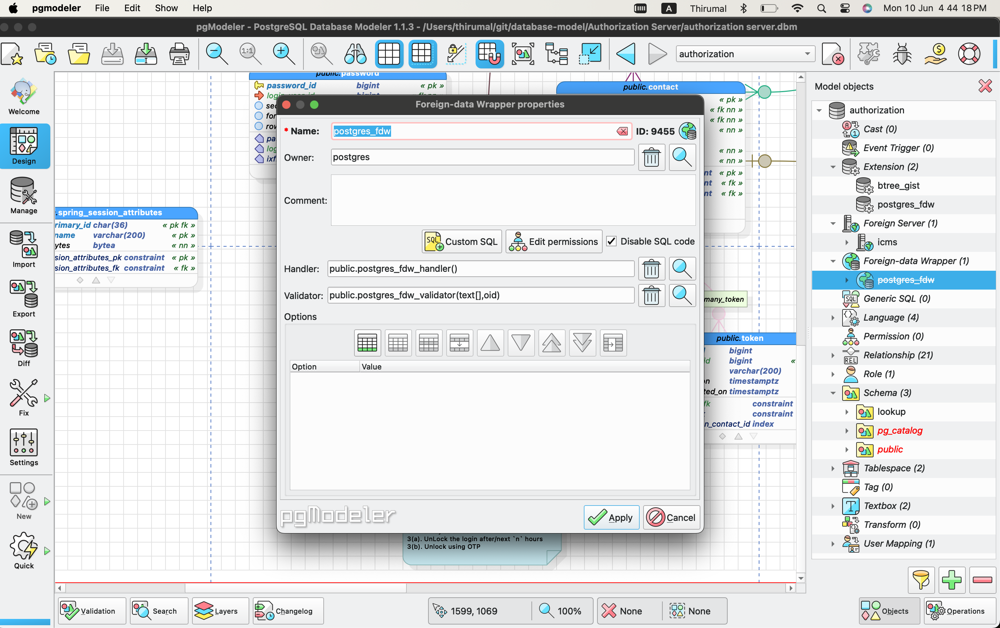

# FDW - Foreign Data Wrapper

A foreign data wrapper is an extension available in PostgreSQL that allows you to consume data from different data sources not necessarily another PostgreSQL database system. Foreign data wrappers can serve all sorts of purposes:

   * Completing a data flow cycle
   * Your data may be segregated across databases, but still related in ways that makes being able to combine or aggregate it desirable
   * Allows you to control the permissions on the foreign tables

## Set up in Local Server

1. Add `postgres_fdw` extension

2. Create two function
    1. Handler with name `postgres_fdw_handler`
    2. Validator with name `postgres_fdw_validator`

3. Create FDW (Foreign  Data Wrapper), with the above created `handler` and `validator`.

4. Create `Foreign Server` with the following options
    1. dbname
    2. host

## Set in Remote server

1. Create `read_only` user in the `remote server` with enough `privilage` on the `schema/tables`.

2. [Role](./Role.md)